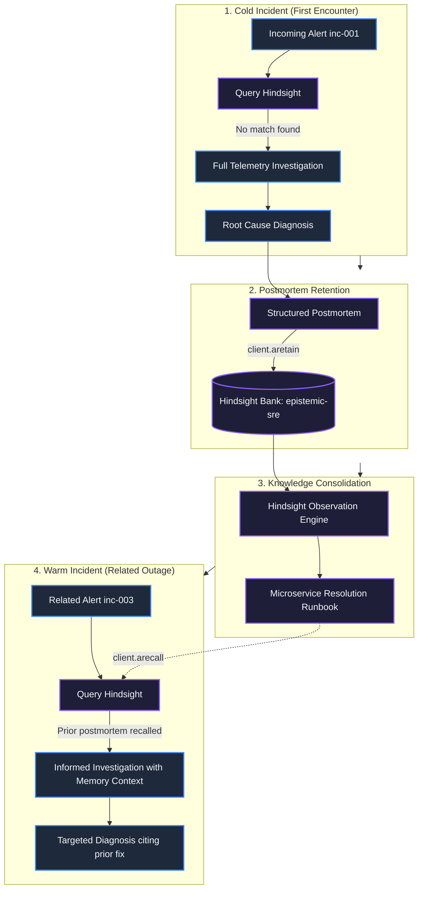
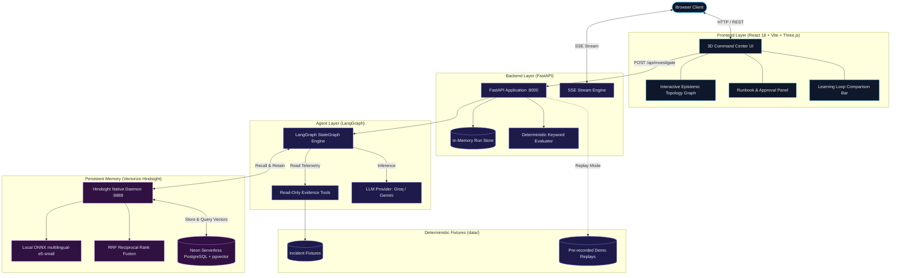
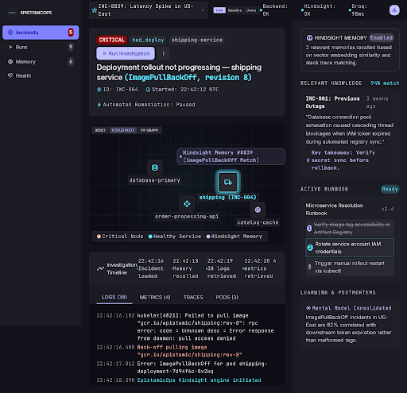
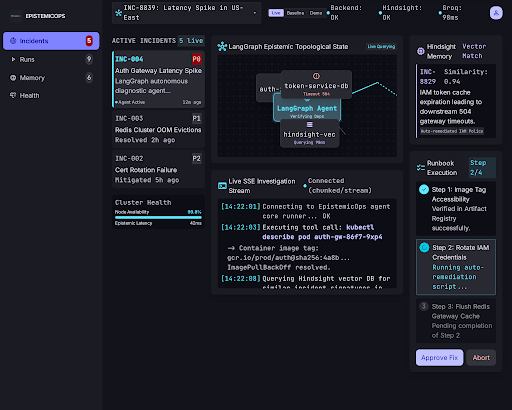
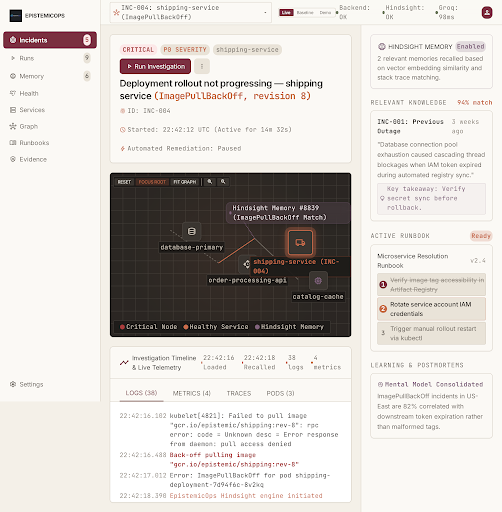
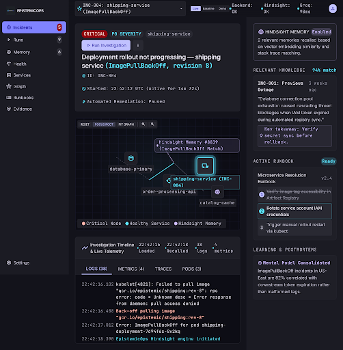

# EpistemOps

An autonomous Site Reliability Engineering (SRE) incident-response agent powered by LangGraph, using **Vectorize Hindsight** as its persistent operational memory to recall and consolidate postmortem knowledge across outages.

**Quick links:**
- [Live Demo](https://epistemicops.onrender.com)
- [GitHub](https://github.com/abhimarkzz/Epistemops)
- [Article](docs/ARTICLE_FINAL.md) *(Pending public platform URL — draft ready)*
- [YouTube](docs/VIDEO_SCRIPT.md) *(Pending public upload — script ready)*

---

## The Problem

When a production microservice fails at 3 a.m., the slowest part of the resolution is rarely typing the command to fix it — it is reconstructing operational context. On-call engineers scramble across fragmented telemetry, past Slack threads, and tribal knowledge asking: *"Didn't the payment service exhaust its connection pool like this last month? What was the culprit query? Which deployment triggered it?"* 

Stateless incident-response assistants do not solve this problem. Every time an outage occurs, a stateless LLM starts with an empty context window, re-inspecting logs and traces from zero and re-learning failure modes the engineering organization already paid to diagnose.

## The Idea

Stateless AI agents fail in operations because operational expertise is cumulative. Passing raw chat history into subsequent prompts is fragile, bounded by token limits, and lacks semantic indexing. 

EpistemicOps pairs a bounded, acyclic LangGraph diagnostic agent with **Hindsight** — an agent memory layer. Rather than treating memory as an afterthought or conversational scratchpad, EpistemicOps records structured postmortems upon incident resolution, consolidates recurring patterns into a living **Microservice Resolution Runbook**, and semantically recalls past lessons when related alerts fire.

## How EpistemOps Works

1. **Incident Ingestion:** The agent receives an alert with service identity, error rate spikes, and symptom metadata.
2. **Memory Query (Recall):** Before executing diagnostic queries, the agent queries Hindsight for semantically relevant past postmortems and playbooks.
3. **Investigation:** The agent invokes read-only evidence tools (`get_logs`, `get_metrics`, `get_trace`, `get_pod_status`) to gather live cluster telemetry.
4. **Diagnosis & Validation:** An LLM synthesizes root cause, evidence citations, and safe remediation steps into a structured, validated schema.
5. **Postmortem Retention (Retain):** The validated diagnosis is formatted as a structured postmortem and asynchronously retained in Hindsight.
6. **Consolidation:** Hindsight synthesizes retained postmortems into an evolving runbook (Mental Model) to inform subsequent investigations.

## Why Hindsight Is Central

Hindsight is the foundational operational spine of EpistemicOps:

- **RETAIN:** After incident validation, `MemoryService.retain_incident()` writes a structured postmortem directly to the `epistemic-sre` memory bank via `client.aretain()`. Raw, noisy log lines are stripped; only synthesized findings, evidence keywords, and remediation steps are preserved.
- **RECALL:** At the start of an incident, `query_incident_patterns()` performs semantic vector recall (`client.arecall()`) to fetch prior failure signatures. Because vector recall runs without an LLM invocation, memory retrieval is immune to LLM rate limits and quotas.
- **Consolidation & Reflection:** Hindsight's background observation engine synthesizes cross-incident observations, identifying recurring systemic bottlenecks across separate services.
- **Mental Model / Runbook:** Hindsight organizes retained postmortems into the **Microservice Resolution Runbook** (`microservice-resolution-runbook`), tracking live operational procedures that update dynamically as new incidents are diagnosed.

## Cold → Retain → Consolidate → Warm



## Baseline

To evaluate the tangible value of memory scientifically, EpistemicOps includes a dedicated **Baseline Mode**:

- Setting `skip_memory=True` (`?baseline=true`) disables Hindsight retrieval.
- The agent investigates the incident purely from first principles without historical context.
- Running the same incident fixture in Baseline (cold control) and Live (memory-enabled) allows side-by-side comparison of elapsed investigation time, tool invocations, confidence scores, and evaluator ground-truth fidelity.

## Architecture



## Key Features

- **Autonomous SRE Investigation:** Investigates microservice outages across logs, metrics, distributed traces, and pod health tables via an acyclic LangGraph workflow.
- **Persistent Hindsight Memory Layer:** Retains postmortems and recalls prior incident resolutions without relying on ephemeral chat histories.
- **Evolving Microservice Runbook:** Maintains a self-updating Hindsight Mental Model reflecting proven remediation playbooks.
- **Human-in-the-Loop Memory Governance:** Postmortem records require explicit engineer approval before higher trust weighting is applied.
- **Side-by-Side Learning Loop Comparison:** Directly compares baseline (memory-off) versus warm (memory-on) runs across wall-clock latency, tool calls, and ground-truth evidence overlap.
- **Zero-External-API Embedding Engine:** Uses in-process ONNX `multilingual-e5-small` embeddings and reciprocal rank fusion (`rrf`), removing external embedding API dependencies and costs.
- **Air-Gapped Telemetry Safety:** All tools operate on strictly read-only simulated cluster fixtures. Zero shell commands, write APIs, or mutating actions are allowed.
- **Deterministic Replay Demo Mode:** Includes verified, pre-recorded SSE event streams for deterministic demonstration when external network access is offline.

## Tech Stack

- **Agent Framework:** LangGraph (`>=0.2.60`), LangChain Core (`>=0.3.0`)
- **Backend:** FastAPI (`>=0.115.0`), Uvicorn (`>=0.30.0`), Pydantic v2, HTTPX, sse-starlette
- **LLM Providers:** Groq (`langchain-groq`, default: `openai/gpt-oss-120b`), optional Google Gemini (`gemini-3.8-flash`)
- **Memory Engine:** Vectorize Hindsight API v0.10.1 (`hindsight-client`, `hindsight-api-slim`)
- **Embeddings & Reranking:** Local ONNX runtime (`intfloat/multilingual-e5-small`, 384 dimensions), Reciprocal Rank Fusion (`rrf`)
- **Database:** Serverless Neon PostgreSQL with `pgvector` extension (or local embedded `pg0`)
- **Frontend:** React 18, TypeScript, Vite 5, Tailwind-free Vanilla CSS design system
- **3D Visualization:** Three.js, React Three Fiber (`@react-three/fiber`), `@react-three/drei`, Motion

## Screenshots

| Command Center & Investigation Queue | Warm Memory & Active Investigation |
|:---:|:---:|
|  |  |
| *Command Center showing active incident queue, health probes, and 3D epistemic topology.* | *Agent executing bounded evidence tools while recalling past postmortem signatures from Hindsight.* |

| Warm Memory Editorial View | Microservice Resolution Runbook & Compare |
|:---:|:---:|
|  |  |
| *Timeline displaying verified Hindsight memory hits and recalled root-cause remediation patterns.* | *Microservice Resolution Runbook mental model and side-by-side cold vs warm run comparison.* |

## Quick Start

### 1. Prerequisites
- Python 3.11+
- Node.js 20+
- Free Groq API key ([console.groq.com](https://console.groq.com))
- (Optional) Free Neon PostgreSQL connection string with `pgvector` ([neon.tech](https://neon.tech))

### 2. Clone and Setup Environment

Run in your terminal from your chosen projects directory:
```bash
git clone https://github.com/abhimarkzz/Epistemops.git epistemicops
cd epistemicops
```

Create your configuration from the template:
```bash
# In the repository root
cp .env.example backend/.env
```

Open `backend/.env` and add your Groq key:
```ini
GROQ_API_KEY=gsk_your_groq_api_key_here
```

### 3. Setup Python Backend & Hindsight Native

Run in the repository root:
```bash
# 1. Create and populate backend virtualenv
cd backend
python3 -m venv .venv
source .venv/bin/activate
pip install -r requirements.txt
cd ..

# 2. Create and populate Hindsight native virtualenv
python3 -m venv .venv-hindsight
.venv-hindsight/bin/pip install --upgrade pip
.venv-hindsight/bin/pip install 'hindsight-api-slim[local-onnx,embedded-db]==0.10.1'
```

### 4. Setup Frontend

Run in the repository root:
```bash
cd frontend
npm ci
cd ..
```

### 5. Launch Services

**Terminal 1 — Native Hindsight Memory Engine:**
```bash
# In the repository root
bash scripts/hindsight-native.sh
```
*Wait until output displays:* `Starting native Hindsight on http://localhost:8888`

**Terminal 2 — FastAPI Backend:**
```bash
# In the repository root
cd backend
source .venv/bin/activate
uvicorn app.main:app --host 127.0.0.1 --port 8000 --reload
```

**Terminal 3 — Frontend Dev Server:**
```bash
# In the repository root
cd frontend
npm run dev
```

Open your browser to: **`http://localhost:5173`**

---

## Environment Variables

All variables are defined in `backend/.env` (backend only — never exposed to client bundles):

| Variable | Default | Purpose |
|---|---|---|
| `LLM_PROVIDER` | `groq` | Active LLM provider (`groq` or `gemini`). |
| `GROQ_API_KEY` | *(required)* | Free-tier Groq API key for agent diagnosis. |
| `GROQ_MODEL` | `openai/gpt-oss-120b` | Model identifier used for agent inference. |
| `GEMINI_API_KEY` | *(optional)* | Google Gemini API key if using Gemini provider. |
| `GEMINI_MODEL` | `gemini-3.8-flash` | Gemini model identifier when Gemini is selected. |
| `HINDSIGHT_BASE_URL` | `http://127.0.0.1:8888` | Loopback address of Hindsight native daemon. |
| `HINDSIGHT_BANK_ID` | `epistemic-sre` | Isolated memory bank ID for EpistemicOps. |
| `HINDSIGHT_MENTAL_MODEL_ID` | `microservice-resolution-runbook` | ID of the evolving SRE resolution runbook. |
| `HINDSIGHT_API_DATABASE_URL` | *(optional)* | Neon PostgreSQL connection URI (`postgresql://...`). When omitted, uses local embedded `pg0`. |
| `BACKEND_HOST` | `127.0.0.1` | Local bind address for FastAPI backend. |
| `BACKEND_PORT` | `8000` | Port for FastAPI backend. |
| `CORS_ORIGIN` | `http://localhost:5173` | Allowed frontend origin for CORS headers. |
| `MAX_AGENT_STEPS` | `8` | Defensive safety bound for LangGraph acyclic recursion limit. |
| `LLM_TIMEOUT` | `60` | Request timeout in seconds for LLM invocations. |
| `ALLOW_PUBLIC_RESET` | `true` | Allows wiping demo bank from UI (set `false` on public deployments). |
| `ADMIN_TOKEN` | *(optional)* | Required Bearer token if `ALLOW_PUBLIC_RESET` is false. |

---

## Demo Walkthrough

Follow this 6-step walkthrough to reproduce the complete learning loop:

1. **Step 1: Cold Run (inc-003):**
   - Select **inc-003** (`orders` service, `bad_deploy`, P1) in the left Incident Queue.
   - Select **Live** mode.
   - Click **Run Investigation**.
   - Notice in the timeline: `memory_result: found=false`. The agent gathers logs, metrics, trace, and pod status, diagnoses the issue, and outputs a structured postmortem.
2. **Step 2: Retain Postmortem:**
   - In the right-hand **Runbook / Memory** panel, observe the new postmortem for `inc-003` under *Recent Retained Postmortems*.
   - Click **Approve** to mark the postmortem as vetted operational knowledge.
3. **Step 3: Consolidate Knowledge:**
   - Click **↻ Refresh Runbook** in the Runbook panel.
   - Hindsight updates the *Microservice Resolution Runbook*, extracting the bad deployment rollback pattern.
4. **Step 4: Warm Run (inc-004):**
   - Select **inc-004** (`shipping` service, `bad_deploy`, P1) — a related deployment failure.
   - Ensure **Live** mode is selected and click **Run Investigation**.
   - Notice in the timeline: `memory_result: found=true` with `memory_used: true`. The agent recalls the bad deployment pattern from `inc-003` and cites prior remediation.
5. **Step 5: Baseline Mode (Control Run):**
   - Select **inc-004** again.
   - Select **Baseline** mode (skips Hindsight memory query).
   - Click **Run (baseline)**.
   - The agent solves the incident without historical context (`memory_used: false`).
6. **Step 6: Compare Results:**
   - In the bottom bar, click **Compare last 2**.
   - A side-by-side comparison modal displays elapsed execution time, tool invocations, confidence scores, and evaluator ground-truth pass/fail without fabricated claims.

---

## Live Demo

A public deployment of EpistemicOps is available for evaluation:
- **Public URL:** [https://epistemicops.onrender.com](https://epistemicops.onrender.com)
- *Note:* Free instance spins down after inactivity; initial wake-up may take ~45 seconds.

## Video

A demonstration recording walking through the architecture and live learning loop:
- **YouTube Link:** [Demonstration Video Guide](docs/VIDEO_SCRIPT.md) *(Production script ready; upload in progress)*

## Article

In-depth technical write-up detailing Hindsight integration, architectural choices, and lessons learned:
- **Article Link:** [Read the Article Draft](docs/ARTICLE_FINAL.md) *(Target platforms: Medium / Dev.to / Hashnode / LinkedIn)*

---

## Project Structure

```
epistemicops/
├── backend/
│   ├── app/
│   │   ├── agent/             # LangGraph state machine, prompts, tools, memory wrappers
│   │   │   ├── graph.py       # Acyclic StateGraph definition and execution loop
│   │   │   ├── memory.py      # Delegation layer to MemoryService
│   │   │   ├── prompts.py     # System instructions and analysis prompt builder
│   │   │   ├── tools.py       # Read-only telemetry evidence tools
│   │   │   └── types.py       # Pydantic schemas for events and diagnoses
│   │   ├── memory/            # Hindsight integration and approval persistence
│   │   │   ├── schemas.py     # PostmortemRecord, RunbookStatus, MemoryStatus
│   │   │   └── service.py     # Hindsight client wrapper, mental model manager
│   │   ├── config.py          # Centralized settings and provider auto-detection
│   │   ├── eval.py            # Transparent ground-truth keyword evaluator
│   │   ├── fixtures.py        # FixtureService with ground-truth isolation
│   │   ├── main.py            # FastAPI endpoints, SSE streaming, static SPA mount
│   │   └── runs.py            # Run record storage and cold/warm comparison logic
│   ├── requirements.txt       # Production Python dependencies
│   └── tests/                 # Comprehensive test suite (152 unit and integration tests)
├── frontend/
│   ├── src/
│   │   ├── components/        # UI panels, Three.js epistemic scene, legal dialog
│   │   ├── App.tsx            # Main dashboard and state coordinator
│   │   ├── api.ts             # Typed REST and SSE communication layer
│   │   └── types.ts           # Frontend TypeScript data contracts
│   ├── package.json           # Node dependencies and build scripts
│   └── vite.config.ts         # Vite build configuration with backend proxy
├── data/
│   ├── incidents/             # Realistic synthetic microservice incident fixtures
│   ├── demo_events/           # Deterministic pre-recorded SSE event streams
│   └── memory_state.json      # Persistent local approval tracking store
├── deploy/                    # Production deployment configurations (Docker, systemd, Caddy)
├── docs/                      # Architectural specs, deep-dives, and publication checklists
├── scripts/
│   ├── demo.sh                # Automated CLI demonstration script
│   ├── hindsight-native.sh    # Startup wrapper for native Hindsight daemon
│   ├── init_hindsight.py      # Idempotent memory bank and runbook initializer
│   └── verify_db_schema.py    # Neon PostgreSQL 384-dimension vector validator
├── Dockerfile                 # Multi-stage production container build
├── start.sh                   # Container entrypoint orchestrating Hindsight & FastAPI
└── docker-compose.yml         # Containerized local Hindsight compose service
```

---

## Data & Attribution

- **Incident Telemetry Data:** Incident fixtures (`data/incidents/inc-003`, `inc-004`, `inc-005`) are derived under Apache-2.0 from [`quantranger/sre-agent-eda-bundle`](https://huggingface.co/datasets/quantranger/sre-agent-eda-bundle). Evidence schemas (pod status, log lines, metrics, distributed traces) reflect authentic Kubernetes failure patterns.
- **Ground Truth Isolation:** Ground truth blocks (`_ground_truth`) were hand-authored by the project maintainers for automated scoring. These blocks are stripped by `FixtureService` before telemetry reaches the agent.
- **Third-Party Libraries:** Complete open-source licensing notices are cataloged in [docs/ATTRIBUTIONS.md](docs/ATTRIBUTIONS.md).

---

## Safety / Scope

- **Strictly Read-Only:** EpistemicOps contains zero mutating tools. It cannot execute shell commands, run `kubectl delete`, apply Terraform configurations, or restart containers.
- **Zero Real Credential Ingestion:** Tests and demo runs use synthetic cluster tokens and mock fixtures.
- **No Client Key Exposure:** All LLM API keys and database credentials reside exclusively in the backend runtime. Client-side builds contain zero credentials.
- **Data Privacy & Telemetry:** EpistemicOps sets zero browser tracking cookies, includes zero third-party analytics scripts (no PostHog, Mixpanel, or Google Analytics), and only sends synthetic fixture data to the configured LLM.

---

## Testing

Verified test metrics from current repository test runs:

- **Backend Pytest Suite:** **152 passed** in 1.62s (`pytest backend/tests`).
  - Unit tests cover LangGraph state transitions, provider selection, evidence sanitization, memory service isolation, and deterministic keyword evaluation.
  - Zero external network calls required during testing (all LLM and Hindsight calls are mocked).
- **Frontend Vitest Suite:** **9 passed** in 2.71s (`npm test --prefix frontend`).
  - Covers 3D topology state synchronization, incident selection, demo mode safety guards, and modal accessibility.
- **TypeScript & Production Build:** Clean build with zero type errors (`tsc && vite build`).

---

## Known Limitations

1. **Synthetic Fixtures:** Telemetry is sourced from deterministic JSON fixtures rather than live cluster streaming pipelines (e.g. Prometheus/Loki).
2. **Evaluator Heuristics:** The verification evaluator uses deterministic substring and keyword matching against ground-truth items. It is not an opaque semantic AI judge.
3. **Consolidation Rate Limits:** On free-tier LLM endpoints (such as Groq free tier), heavy background consolidation of multiple memories can occasionally encounter tokens-per-minute pauses. Vector recall operates independently of these limits and remains instantaneous.
4. **Single-Run Variance:** Single cold/warm execution time comparisons are subject to network jitter and LLM generation variance. True distribution shifts should be measured across repeated batches.

---

## Documentation

- [Hindsight Technical Explanation](docs/HINDSIGHT_EXPLANATION.md) — Comprehensive guide to Hindsight retention, recall, and runbooks.
- [Detailed Architecture Specification](docs/architecture.md) — Deep-dive into state machines and data flows.
- [Step-by-Step Demo Guide](docs/DEMO.md) — Judge-friendly walkthrough of the learning loop.
- [Production Deployment Guide](docs/DEPLOYMENT.md) — Multi-stage Docker, Render, and Neon pgvector deployment.
- [Third-Party Attributions](docs/ATTRIBUTIONS.md) — Comprehensive license and source attributions.
- [Submission Package & Checklists](docs/SUBMISSION_CHECKLIST.md) — Verification matrix and deliverable status.

---

## License

This project is licensed under the **Apache-2.0 License**. See the `LICENSE` file for details.

## Acknowledgements

- Built with [Vectorize Hindsight](https://github.com/vectorize-io/hindsight) for long-term AI agent memory.
- Powered by [LangGraph](https://github.com/langchain-ai/langgraph) for bounded cyclical and acyclic state orchestration.
- Telemetry patterns adapted from [`quantranger/sre-agent-eda-bundle`](https://huggingface.co/datasets/quantranger/sre-agent-eda-bundle).
