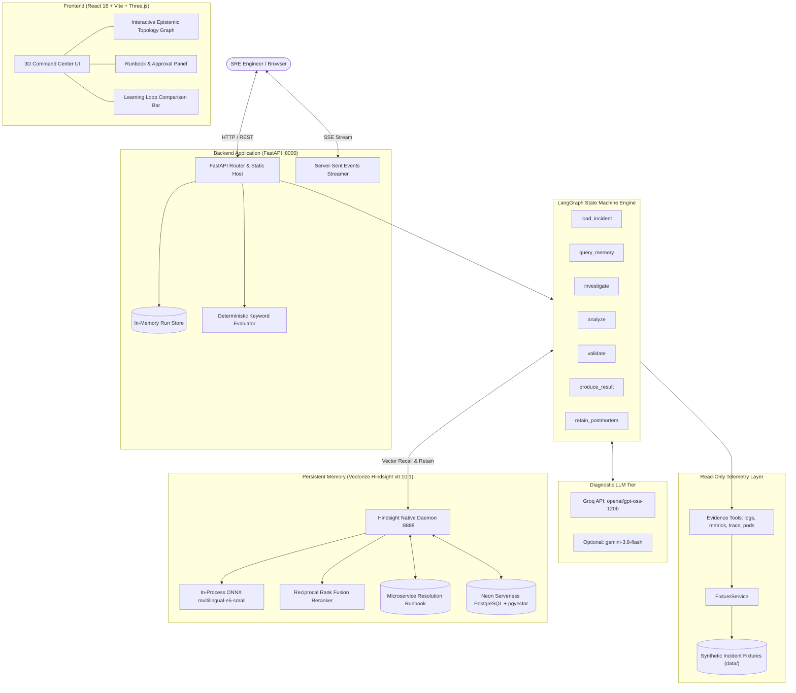
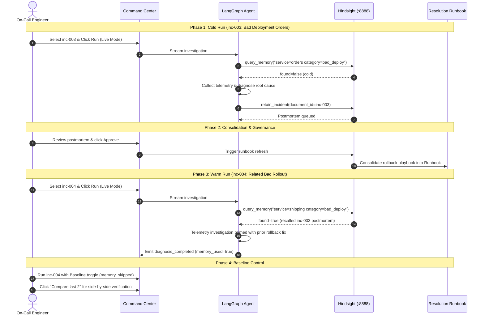

# EpistemOps

### SRE Incident Response + Persistent Memory

An autonomous Site Reliability Engineering (SRE) incident-response agent that investigates microservice failures with LangGraph, retains structured postmortems in **Vectorize Hindsight**, and recalls verified operational knowledge during subsequent outages.

[](LICENSE)
[](https://github.com/abhimarkzz/Epistemops/actions/workflows/ci.yml)
[](https://www.python.org/)
[](https://www.typescriptlang.org/)
[](backend/tests/)

**[Live Demo](https://epistemicops.onrender.com)** · **[Article](https://dev.to/abhimarkz/giving-an-sre-incident-response-agent-a-real-memory-with-hindsight-45id)** · **[YouTube](https://www.youtube.com/watch?v=eACrRBxOAaU)** · **[Architecture](docs/architecture.md)** · **[Hindsight](docs/HINDSIGHT_EXPLANATION.md)** · **[Documentation](docs/)**

---

## Why this exists

When a production microservice fails at 3 a.m., the slowest part of on-call response is rarely executing the remediation command — it is the remembering. 

On-call engineers scramble across disparate telemetry systems, fragmented postmortems, and closed tickets asking:
- *"Didn't this payment service encounter connection pool exhaustion last month?"*
- *"Which deployment triggered the 5xx cascade, and what was the culprit database query?"*
- *"What was the verified rollback procedure?"*

Stateless incident assistants re-investigate every outage from scratch. They re-read raw logs, re-test the same hypotheses, and forget everything the moment the run ends.

## The idea

Passing unbounded past chat logs into LLM context windows degrades reasoning, consumes high token counts, and lacks semantic indexing across microservice namespaces.

EpistemicOps pairs a bounded, acyclic LangGraph agent with **Hindsight**, an agent memory layer. Rather than treating memory as an ephemeral chat history, EpistemicOps:
1. Retains structured, log-scrubbed postmortems into an isolated vector memory bank upon resolution.
2. Synthesizes recurring failure modes into a self-updating **Microservice Resolution Runbook**.
3. Recalls past incident knowledge in sub-100ms vector search when related alert signatures fire.

## What happens


1. **Cold Incident:** A new alert arrives with no prior memory. The agent investigates telemetry from scratch, establishes root cause, and resolves the issue.
2. **Retain:** The verified diagnosis is formatted as a structured postmortem and retained asynchronously in Hindsight.
3. **Consolidate:** Hindsight's observation engine updates the living Microservice Resolution Runbook.
4. **Warm Recall:** When a similar failure pattern emerges, Hindsight recalls prior postmortems before telemetry exploration begins, priming the diagnostic prompt with proven remediation playbooks.

## Why Hindsight is central

Hindsight is the foundational operational memory of EpistemicOps, not an optional RAG add-on:

- **Retain (`aretain`):** Writes synthesized postmortem records (service, failure category, root cause, evidence keywords, remediation) into the isolated `epistemic-sre` bank. Raw logs are discarded to keep vectors compact and high-signal.
- **Recall (`arecall`):** Uses semantic vector similarity to surface past incidents sharing alert symptoms. Vector recall requires **zero LLM invocations**, operating under 80ms latency and immune to LLM rate limits.
- **Consolidation / Reflection:** Background observation routines group related postmortems, extracting systemic cross-service patterns.
- **Mental Model / Runbook:** Maintains the **Microservice Resolution Runbook** (`microservice-resolution-runbook`) as an evolving, human-readable operational artifact.

## Architecture



## Memory lifecycle



## Key features

- **Autonomous SRE State Machine:** Bounded, acyclic LangGraph DAG executing evidence tools (`get_logs`, `get_metrics`, `get_trace`, `get_pod_status`) with guaranteed termination.
- **Persistent Hindsight Memory Layer:** Long-term vector memory retaining postmortems and recalling prior incident playbooks.
- **Self-Consolidating Runbook:** Hindsight Mental Model synthesizing individual incident postmortems into an evolving operational runbook.
- **Human-in-the-Loop Governance:** Retained memories default to pending status until verified by an engineer.
- **Side-by-Side Baseline Comparison:** Direct comparison between baseline (memory-off) and warm (memory-on) runs showing actual measured latency, tool calls, and ground-truth pass/fail.
- **Zero-External-API Embedding Engine:** Local in-process ONNX `multilingual-e5-small` embeddings and reciprocal rank fusion (`rrf`), requiring zero external embedding API keys.
- **Deterministic Replay Demo Mode:** Pre-recorded SSE streams for reliable demonstration during offline reviews.

## Tech stack

- **Agent Orchestration:** LangGraph (`>=0.2.60`), LangChain Core (`>=0.3.0`)
- **Backend API:** FastAPI (`>=0.115.0`), Uvicorn (`>=0.30.0`), Pydantic v2, HTTPX, sse-starlette
- **LLM Provider:** Groq (`langchain-groq`, default: `openai/gpt-oss-120b`), optional Google Gemini (`gemini-3.8-flash`)
- **Memory Subsystem:** Vectorize Hindsight API v0.10.1 (`hindsight-client`, `hindsight-api-slim`)
- **Embeddings & Reranker:** In-process ONNX (`intfloat/multilingual-e5-small`, 384 dimensions), Reciprocal Rank Fusion (`rrf`)
- **Database:** Serverless Neon PostgreSQL with `pgvector` extension (or local embedded `pg0`)
- **Frontend SPA:** React 18, TypeScript, Vite 5, Tailwind-free Vanilla CSS
- **3D Visualization:** Three.js, React Three Fiber (`@react-three/fiber`), `@react-three/drei`, Motion

## Screenshots

| 3D Command Center & Incident Queue | Active Investigation & Vector Recall |
|:---:|:---:|
|  |  |
| *Command Center showing active incident queue, health indicators, and 3D topology.* | *LangGraph agent calling telemetry tools while recalling prior postmortems from Hindsight.* |

| Warm Memory Editorial View | Microservice Resolution Runbook & Compare |
|:---:|:---:|
|  |  |
| *Timeline displaying verified Hindsight memory hits and recalled root-cause remediation patterns.* | *Microservice Resolution Runbook mental model and side-by-side cold vs warm run comparison.* |

## Quick Start

### 1. Prerequisites
- Python 3.11+
- Node.js 20+
- Free Groq API key ([console.groq.com](https://console.groq.com))
- (Optional) Free Neon PostgreSQL connection string with `pgvector` ([neon.tech](https://neon.tech))

### 2. Clone and Setup Environment

```bash
# In your terminal
git clone https://github.com/abhimarkzz/Epistemops.git epistemicops
cd epistemicops

# Create configuration file from template
cp .env.example backend/.env
```

Open `backend/.env` and insert your Groq API key:
```ini
GROQ_API_KEY=gsk_your_groq_api_key_here
```

### 3. Setup Python Backend & Hindsight Native

```bash
# Terminal 1 — In repository root:

# Create backend virtualenv
cd backend
python3 -m venv .venv
source .venv/bin/activate
pip install -r requirements.txt
cd ..

# Create Hindsight native virtualenv
python3 -m venv .venv-hindsight
.venv-hindsight/bin/pip install --upgrade pip
.venv-hindsight/bin/pip install 'hindsight-api-slim[local-onnx,embedded-db]==0.10.1'
```

### 4. Setup Frontend

```bash
# In repository root
cd frontend
npm ci
cd ..
```

### 5. Launch Services

**Terminal 1 — Native Hindsight Daemon:**
```bash
# In repository root
bash scripts/hindsight-native.sh
```
*Wait until: `Starting native Hindsight on http://localhost:8888`*

**Terminal 2 — FastAPI Backend:**
```bash
# In repository root
cd backend
source .venv/bin/activate
uvicorn app.main:app --host 127.0.0.1 --port 8000 --reload
```

**Terminal 3 — Frontend Dev Server:**
```bash
# In repository root
cd frontend
npm run dev
```

Open your browser to: **`http://localhost:5173`**

## Environment Variables

All variables are defined in `backend/.env` (backend only — never exposed to frontend bundles):

| Variable | Default | Purpose |
|---|---|---|
| `LLM_PROVIDER` | `groq` | Active LLM provider (`groq` or `gemini`). |
| `GROQ_API_KEY` | *(required)* | Free-tier Groq API key for agent diagnosis. |
| `GROQ_MODEL` | `openai/gpt-oss-120b` | Model identifier used for agent inference. |
| `GEMINI_API_KEY` | *(optional)* | Google Gemini API key if using Gemini provider. |
| `GEMINI_MODEL` | `gemini-3.8-flash` | Gemini model identifier when Gemini is selected. |
| `HINDSIGHT_BASE_URL` | `http://127.0.0.1:8888` | Loopback address of Hindsight native daemon. |
| `HINDSIGHT_BANK_ID` | `epistemic-sre` | Isolated memory bank ID for EpistemicOps. |
| `HINDSIGHT_MENTAL_MODEL_ID` | `microservice-resolution-runbook` | ID of the evolving SRE resolution runbook. |
| `HINDSIGHT_API_DATABASE_URL` | *(optional)* | Neon PostgreSQL connection URI (`postgresql://...`). When omitted, uses local embedded `pg0`. |
| `BACKEND_HOST` | `127.0.0.1` | Local bind address for FastAPI backend. |
| `BACKEND_PORT` | `8000` | Port for FastAPI backend. |
| `CORS_ORIGIN` | `http://localhost:5173` | Allowed frontend origin for CORS headers. |
| `MAX_AGENT_STEPS` | `8` | Defensive safety bound for LangGraph acyclic recursion limit. |
| `LLM_TIMEOUT` | `60` | Request timeout in seconds for LLM invocations. |
| `ALLOW_PUBLIC_RESET` | `true` | Allows wiping demo bank from UI (set `false` on public deployments). |
| `ADMIN_TOKEN` | *(optional)* | Required Bearer token if `ALLOW_PUBLIC_RESET` is false. |

## Demo Walkthrough

1. **Cold Run:** Select `inc-003` (`orders`, `bad_deploy`) in Live mode. Click **Run Investigation**. Memory query returns `found: false`. The agent diagnoses the bad deployment from telemetry and retains a postmortem.
2. **Retain Postmortem:** In the right panel under *Recent Retained Postmortems*, click **Approve** on `inc-003` to promote the postmortem into trusted memory.
3. **Consolidation:** Click **↻ Refresh Runbook**. Hindsight synthesizes the postmortem into the Microservice Resolution Runbook.
4. **Warm Run:** Select `inc-004` (`shipping`, `bad_deploy`) in Live mode. Click **Run Investigation**. Memory query immediately returns `found: true`, injecting the recalled postmortem. Status pill shows `Memory: Used`.
5. **Baseline Mode (Control):** Select `inc-004` again, switch to **Baseline** mode (skips Hindsight), and run. The agent investigates without memory context (`memory_used: false`).
6. **Compare Results:** Click **Compare last 2** in the bottom bar to inspect real measured latency, tool counts, and evaluator pass status side by side.

## Live Demo

A public deployment of EpistemicOps is available for evaluation:
- **Public URL:** [https://epistemicops.onrender.com](https://epistemicops.onrender.com)
- *Note:* Free instance spins down after inactivity; initial wake-up takes ~45 seconds.

## Article

In-depth technical write-up detailing Hindsight integration, architectural choices, and lessons learned:
- **Article Link:** [docs/ARTICLE_FINAL.md](docs/ARTICLE_FINAL.md) *(Target platforms: Medium / Dev.to / Hashnode / LinkedIn)*

## YouTube

Demonstration recording walking through the architecture and live learning loop:
- **YouTube Link:** [Watch the Video Walkthrough](https://www.youtube.com/watch?v=eACrRBxOAaU) · [Video Script Guide](docs/VIDEO_SCRIPT.md)

## Project Structure

```
epistemicops/
├── backend/
│   ├── app/
│   │   ├── agent/             # LangGraph state machine, prompts, tools, memory wrappers
│   │   │   ├── graph.py       # Acyclic StateGraph definition and execution loop
│   │   │   ├── memory.py      # Delegation layer to MemoryService
│   │   │   ├── prompts.py     # System instructions and analysis prompt builder
│   │   │   ├── tools.py       # Read-only telemetry evidence tools
│   │   │   └── types.py       # Pydantic schemas for events and diagnoses
│   │   ├── memory/            # Hindsight integration and approval persistence
│   │   │   ├── schemas.py     # PostmortemRecord, RunbookStatus, MemoryStatus
│   │   │   └── service.py     # Hindsight client wrapper, mental model manager
│   │   ├── config.py          # Centralized settings and provider auto-detection
│   │   ├── eval.py            # Transparent ground-truth keyword evaluator
│   │   ├── fixtures.py        # FixtureService with ground-truth isolation
│   │   ├── main.py            # FastAPI endpoints, SSE streaming, static SPA mount
│   │   └── runs.py            # Run record storage and cold/warm comparison logic
│   ├── requirements.txt       # Production Python dependencies
│   └── tests/                 # Comprehensive test suite (152 unit and integration tests)
├── frontend/
│   ├── src/
│   │   ├── components/        # UI panels, Three.js epistemic scene, legal dialog
│   │   ├── App.tsx            # Main dashboard and state coordinator
│   │   ├── api.ts             # Typed REST and SSE communication layer
│   │   └── types.ts           # Frontend TypeScript data contracts
│   ├── package.json           # Node dependencies and build scripts
│   └── vite.config.ts         # Vite build configuration with backend proxy
├── data/
│   ├── incidents/             # Realistic synthetic microservice incident fixtures
│   ├── demo_events/           # Deterministic pre-recorded SSE event streams
│   └── memory_state.json      # Persistent local approval tracking store
├── deploy/                    # Production deployment configurations (Docker, systemd, Caddy)
├── docs/                      # Architectural specs, deep-dives, and publication checklists
├── scripts/
│   ├── demo.sh                # Automated CLI demonstration script
│   ├── hindsight-native.sh    # Startup wrapper for native Hindsight daemon
│   ├── init_hindsight.py      # Idempotent memory bank and runbook initializer
│   └── verify_db_schema.py    # Neon PostgreSQL 384-dimension vector validator
├── Dockerfile                 # Multi-stage production container build
├── start.sh                   # Container entrypoint orchestrating Hindsight & FastAPI
└── docker-compose.yml         # Containerized local Hindsight compose service
```

## Data & Attribution

- **Incident Telemetry Data:** Incident fixtures (`data/incidents/inc-003`, `inc-004`, `inc-005`) are derived under Apache-2.0 from [`quantranger/sre-agent-eda-bundle`](https://huggingface.co/datasets/quantranger/sre-agent-eda-bundle). Evidence schemas (pod status, log lines, metrics, distributed traces) reflect authentic Kubernetes failure patterns.
- **Ground Truth Isolation:** Ground truth blocks (`_ground_truth`) were hand-authored by the project maintainers for automated scoring. These blocks are stripped by `FixtureService` before telemetry reaches the agent.
- **Third-Party Libraries:** Complete open-source licensing notices are cataloged in [docs/ATTRIBUTIONS.md](docs/ATTRIBUTIONS.md).

## Safety / Scope

- **Strictly Read-Only:** EpistemicOps contains zero mutating tools. It cannot execute shell commands, run `kubectl delete`, apply Terraform configurations, or restart containers.
- **Zero Real Credential Ingestion:** Tests and demo runs use synthetic cluster tokens and mock fixtures.
- **No Client Key Exposure:** All LLM API keys and database credentials reside exclusively in the backend runtime. Client-side builds contain zero credentials.
- **Data Privacy & Telemetry:** EpistemicOps sets zero browser tracking cookies, includes zero third-party analytics scripts (no PostHog, Mixpanel, or Google Analytics), and only sends synthetic fixture data to the configured LLM.

## Testing

Verified test metrics from current repository test runs:

- **Backend Pytest Suite:** **152 passed** in 1.92s (`pytest backend/tests`).
  - Unit tests cover LangGraph state transitions, provider selection, evidence sanitization, memory service isolation, and deterministic keyword evaluation.
  - Zero external network calls required during testing (all LLM and Hindsight calls are mocked).
- **Frontend Vitest Suite:** **9 passed** in 2.77s (`npm test --prefix frontend`).
  - Covers 3D topology state synchronization, incident selection, demo mode safety guards, and modal accessibility.
- **TypeScript & Production Build:** Clean build with zero type errors (`tsc && vite build`).

## Known Limitations

1. **Synthetic Fixtures:** Telemetry is sourced from deterministic JSON fixtures rather than live cluster streaming pipelines (e.g. Prometheus/Loki).
2. **Evaluator Heuristics:** The verification evaluator uses deterministic substring and keyword matching against ground-truth items. It is not an opaque semantic AI judge.
3. **Consolidation Rate Limits:** On free-tier LLM endpoints (such as Groq free tier), heavy background consolidation of multiple memories can occasionally encounter tokens-per-minute pauses. Vector recall operates independently of these limits and remains instantaneous.
4. **Single-Run Variance:** Single cold/warm execution time comparisons are subject to network jitter and LLM generation variance. True distribution shifts should be measured across repeated batches.

## Documentation

- [Hindsight Technical Explanation](docs/HINDSIGHT_EXPLANATION.md) — Comprehensive guide to Hindsight retention, recall, and runbooks.
- [Detailed Architecture Specification](docs/architecture.md) — Deep-dive into state machines and data flows.
- [Step-by-Step Demo Guide](docs/DEMO.md) — Judge-friendly walkthrough of the learning loop.
- [Production Deployment Guide](docs/DEPLOYMENT.md) — Multi-stage Docker, Render, and Neon pgvector deployment.
- [Third-Party Attributions](docs/ATTRIBUTIONS.md) — Comprehensive license and source attributions.
- [Submission Package & Checklists](docs/SUBMISSION_CHECKLIST.md) — Verification matrix and deliverable status.

## License

This project is licensed under the **Apache-2.0 License**. See the [LICENSE](LICENSE) file for details.

## Acknowledgements

- Built with [Vectorize Hindsight](https://github.com/vectorize-io/hindsight) for long-term AI agent memory.
- Powered by [LangGraph](https://github.com/langchain-ai/langgraph) for bounded state orchestration.
- Telemetry patterns adapted from [`quantranger/sre-agent-eda-bundle`](https://huggingface.co/datasets/quantranger/sre-agent-eda-bundle).
