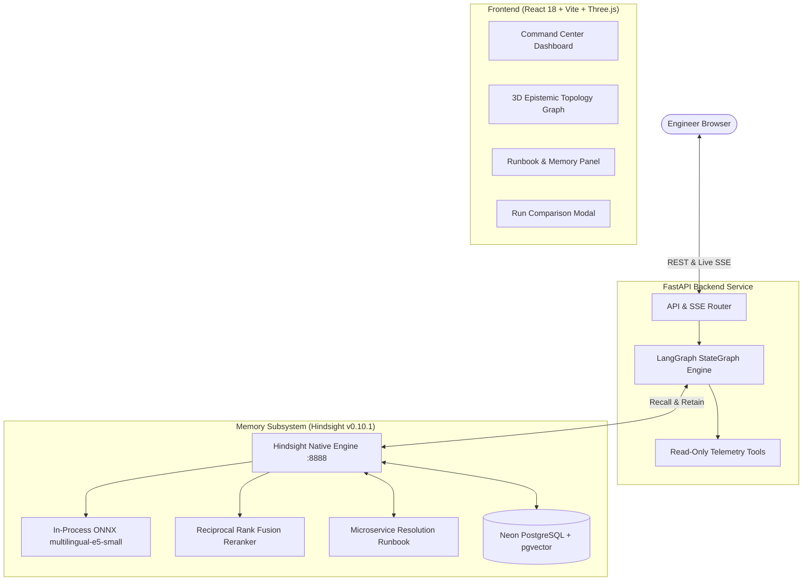

# Giving an SRE Incident-Response Agent a Real Memory with Hindsight

When a production microservice falls over at 3 a.m., the slowest and most agonizing part of the incident response is rarely running the remediation command. It is the remembering.

*"Haven't we seen this database connection pool exhaustion before? What was the culprit query? Who adjusted the max connections last quarter, and what broke when they did?"*

In high-growth engineering teams, that knowledge is scattered across old Slack threads, closed Jira tickets, fragmented postmortems, and the heads of a few senior staff engineers. When an alert fires, on-call engineers spend their most critical initial minutes reconstructing context the organization already paid dearly to learn once.

When AI incident assistants emerged, I hoped they would solve this. But almost every assistant on the market suffers from the same fundamental limitation: they are completely stateless.

---

## Why Stateless Incident Agents Fall Short

A stateless LLM agent can inspect current Kubernetes pod health, parse recent logs, and check Prometheus metric series to produce a plausible diagnosis. But when the same failure or a closely related bug reappears three weeks later, that agent starts from absolute zero.

It cannot say: *"This symptom pattern matches incident INC-001 from last month. In that outage, `SELECT * FROM orders` was missing an index on `tenant_id`, which exhausted the pool. The verified fix was rolling back commit `a4f81c` and adding the index."*

Passing raw past chat history into context windows fails in production operations:
1. Incident logs are massive; stuffing them into prompts burns token quotas and causes "needle-in-a-haystack" reasoning degradation.
2. Chat histories are linear and lack semantic indexing. They cannot retrieve the relevant past playbook when an incident occurs across different services or namespaces.
3. Stateless agents do not accumulate institutional wisdom.

To fix this, I built **EpistemicOps**: an open-source, local-first SRE incident-response agent whose core architecture is centered around **Hindsight**, Vectorize's persistent agent memory system.

---

## System Architecture

EpistemicOps pairs a bounded, acyclic LangGraph state machine with a native Hindsight memory daemon backed by Neon Serverless PostgreSQL with `pgvector`.




*Figure 1: EpistemicOps 3D Command Center rendering active cluster topology, real-time investigation timeline, and memory status.*

---

## Hindsight Is the Spine, Not a RAG Bolt-On

Many AI projects treat memory as an afterthought — a simple vector database storing chunks of text. In EpistemicOps, Hindsight serves as the primary operational backbone:

- **Isolated Memory Bank:** All operational postmortems live in an isolated Hindsight bank (`epistemic-sre`).
- **Selective Retention (RETAIN):** When the agent diagnoses an outage, it writes a structured postmortem to Hindsight. Raw, verbose log lines are deliberately excluded; only synthesized findings, root cause classifications, evidence keywords, and verified remediation steps are saved.
- **Semantic Vector Recall (RECALL):** At the beginning of an investigation, the agent queries Hindsight using the incoming alert signature.
- **Consolidation & Runbooks:** Hindsight's observation engine consolidates multiple postmortems into an evolving **Microservice Resolution Runbook** (Mental Model), synthesizing cross-incident patterns across services.

---

## The Architectural Dead End That Changed the Design

During early development, I ran into an architectural issue worth highlighting.

In my initial prototype, I used Hindsight's agentic `reflect` capability for incident recall. Reflection uses an LLM to reason over memory units before returning an answer. While powerful, reflection requires an upstream LLM call. When testing on free-tier providers, calling the LLM during memory retrieval frequently triggered token-per-minute rate limits, delaying the investigation before evidence gathering even began.

I realized that for SRE operations — where the goal is simply finding similar past incident postmortems — semantic vector recall (`arecall`) was the superior primitive. Vector recall performs similarity search directly across the embedding space without invoking an LLM.

Here is the exact implementation from `backend/app/memory/service.py`:

```python
async def query_memory(self, query: str) -> MemoryQueryResult:
    """Recall prior incident patterns from the Hindsight bank.

    Uses semantic recall (vector search) rather than agentic reflection: it is
    the right primitive for 'find similar past incidents,' needs no LLM call,
    and stays fast and free of provider rate limits.
    """
    client = _client()
    try:
        response = await client.arecall(
            bank_id=settings.hindsight_bank_id,
            query=query,
            budget="low",
            max_tokens=1024,
        )
        answer = _format_recall(getattr(response, "results", None) or [])
        found = bool(answer)
    except Exception as exc:
        logger.warning("Hindsight query_memory failed: %s", exc)
        answer = ""
        found = False
    finally:
        await client.aclose()

    records = self._store.all()
    counts = self._store.counts()
    trust = _trust_level(records, found)

    return MemoryQueryResult(
        answer=answer,
        found=found,
        trust_level=trust,
        pending_count=counts.get("pending", 0),
    )
```

Switching to `arecall` reduced retrieval latency from over 3 seconds to under 80 milliseconds and completely eliminated provider rate-limit failures during incident intake.

---

## The Before and After: Cold vs. Warm Investigation

To measure the impact of memory under identical conditions, EpistemicOps supports both **Live** and **Baseline** modes.


*Figure 2: Active investigation timeline showing the agent recalling past postmortem context before analyzing live telemetry.*

### 1. Cold Incident (First Encounter)
I ran incident `inc-003` (orders microservice experiencing 5xx errors after a bad deployment) in Live mode without prior memories.
- The agent queried Hindsight: `memory_result: found=false`.
- The agent inspected logs, metrics, trace spans, and pod health from scratch.
- It diagnosed the bad deployment and emitted a postmortem (`postmortem_created: success=true`).
- In the UI, the run registered with `memory_used: false`.

### 2. Postmortem Retention & Governance
I approved the retained postmortem in the Runbook panel. Hindsight updated the Microservice Resolution Runbook, capturing the failure signature and the rollback procedure.


*Figure 3: Warm memory editorial view showing verified postmortem citations and evolving resolution runbook.*

### 3. Warm Incident (Related Outage)
I ran incident `inc-004` (shipping service suffering a related bad deployment rollout) in Live mode.
- The agent queried Hindsight: `memory_result: found=true`.
- Hindsight immediately surfaced the `inc-003` postmortem!
- The prompt was injected with the prior resolution context. The agent confirmed the failure pattern and cited the proven rollback playbook.
- The run registered with `memory_used: true`.

### 4. Baseline Mode (Control Run)
To verify the difference was not accidental, I re-ran `inc-004` with **Baseline Mode** enabled (`?baseline=true`). The memory retrieval step was bypassed (`memory_skipped`). The agent was forced to solve the incident from telemetry alone, establishing a clear experimental control.


*Figure 4: Side-by-side run comparison showing measured latency, tool calls, and ground-truth evaluation.*

---

## Honest Limitations and Production Realities

Building EpistemicOps highlighted several engineering constraints:

1. **Memory Does Not Always Equal Speed:** In my tests, warm runs did not consistently complete in fewer seconds than cold runs. The additional context increases prompt token length, which slightly increases LLM generation time. The true value of memory is diagnostic accuracy and citing proven playbooks, not raw execution speed.
2. **Consolidation Limits on Free Tiers:** On free LLM tiers (such as Groq's free tier), background consolidation of multiple postmortems into the Mental Model runbook can occasionally pause due to tokens-per-minute rate limits. Because vector recall operates independently of the LLM, recall continues working without interruption.
3. **Fixture Telemetry vs. Live Streams:** Current investigations run against realistic synthetic fixtures derived from open Kubernetes datasets. Transitioning to live production requires safe, read-only connectors for Prometheus, OpenTelemetry, and Kubernetes audit logs.

---

## Summary & Resources

Persistent memory transforms incident response from an ephemeral guessing game into an accumulating institutional asset. By delegating operational recall and runbook synthesis to Hindsight, EpistemicOps demonstrates how autonomous agents can grow smarter with every outage they resolve.

- **GitHub Repository:** [https://github.com/abhimarkzz/Epistemops](https://github.com/abhimarkzz/Epistemops)
- **Live Demo Application:** [https://epistemicops.onrender.com](https://epistemicops.onrender.com)
- **Vectorize Hindsight:** [https://github.com/vectorize-io/hindsight](https://github.com/vectorize-io/hindsight)
- **Hindsight Documentation:** [https://hindsight.vectorize.io/](https://hindsight.vectorize.io/)
- **Understanding Agent Memory:** [https://vectorize.io/what-is-agent-memory](https://vectorize.io/what-is-agent-memory)
