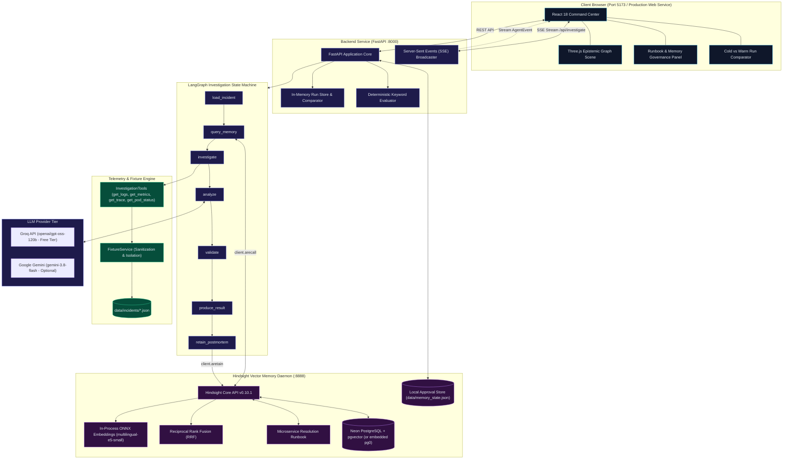
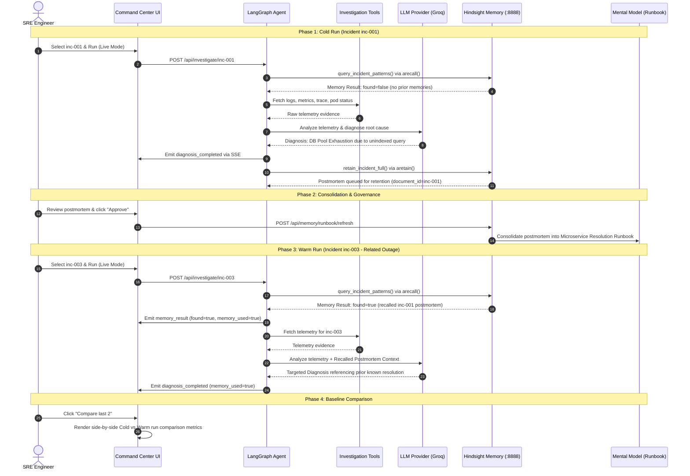

# EpistemOps Architecture Specification

This document provides a comprehensive technical overview of the EpistemicOps architecture, including state machine orchestration, memory lifecycle, evidence collection, and security isolation.

---

## 1. System Architecture

EpistemicOps is structured into three cooperating tiers:
1. **Frontend Presentation Layer (React 18 + Vite + Three.js):** Browser-based 3D Command Center rendering the real-time epistemic graph, live SSE investigation trace, runbook mental model state, and run comparison metrics.
2. **Backend Application Layer (FastAPI + LangGraph):** Orchestrates the investigation state machine, executes read-only telemetry tools against sanitized fixtures, queries LLM providers, and tracks run metrics.
3. **Memory Subsystem (Vectorize Hindsight v0.10.1):** High-performance vector memory bank storing structured postmortems, providing semantic vector recall, and maintaining an evolving SRE runbook backed by Neon Serverless PostgreSQL with `pgvector` (or local embedded `pg0`).



---

## 2. Memory Lifecycle (Cold → Retain → Consolidate → Warm)

The core purpose of EpistemicOps is demonstrating how persistent operational memory overcomes the amnesia of stateless AI agents.



---

## 3. LangGraph Bounded State Machine

The diagnostic agent is implemented as an acyclic `StateGraph` in `backend/app/agent/graph.py`. Unlike unbounded cyclic agents that can loop indefinitely, EpistemicOps enforces deterministic termination:

```
load_incident ──(ok)──> query_memory ──> investigate ──(ok)──> analyze ──(ok)──> validate ──(ok)──> produce_result ──> retain_postmortem ──> END
      │                                       │                     │                    │
   (error)                                 (error)               (error)              (error)
      └───────────────────────────────────────┴─────────────────────┴────────────────────┴───────────────────────────> error_end ──> END
```

### Safety Bounds
- **Acyclic Execution:** The graph transitions strictly forward; there are no feedback loops that can stall or consume unbounded tokens.
- **Defensive Recursion Limit:** LangGraph's `recursion_limit` is set to `settings.max_agent_steps` (default 8). If the 7-node DAG ever encounters an unexpected recursion anomaly, `GraphRecursionError` is caught and surfaced as a clean `run_failed` SSE event.
- **LLM Call Timeout:** `asyncio.wait_for` wraps LLM inference with `settings.llm_timeout` (default 60s) to prevent thread hangs during upstream provider disruptions.

---

## 4. Telemetry Sanitization & Ground-Truth Isolation

EpistemicOps enforces strict boundaries to guarantee that benchmark scoring is fair and that the agent never "cheats":

1. **Hidden Ground Truth:** Fixture JSON files (`data/incidents/*.json`) include a `_ground_truth` object containing root cause categories, expected evidence tokens, canonical fix commands, and forbidden categories.
2. **Sanitization Filter:** `FixtureService` validates and strips all keys matching `HIDDEN_GT_FIELDS` (`_ground_truth`, `ground_truth`, `root_cause`, `root_cause_category`, `expected_evidence`, `canonical_fix`, `fix_tool`, `forbidden_categories`, `resolution_steps`) before the telemetry payload is handed to the agent or frontend.
3. **Automated Leak Guard:** `_node_load_incident` asserts that zero ground-truth keys exist in the loaded incident dictionary. If any leaked key is detected, the run aborts immediately with a failure event.
4. **Post-Run Evaluation:** Only after `produce_result` has yielded the final diagnosis does the evaluator (`app.eval.evaluate_diagnosis`) inspect the diagnosis against the ground truth to compute evidence overlap and category accuracy.

---

## 5. Network & Port Allocation

| Service | Port | Protocol | Scope | Role |
|---|---|---|---|---|
| Frontend Dev Server | 5173 | HTTP | Localhost | Vite development server with API proxy |
| FastAPI Application | 8000 | HTTP / SSE | 127.0.0.1 / Public | REST API, SSE event streaming, production SPA static host |
| Hindsight API Daemon | 8888 | HTTP | 127.0.0.1 (Loopback) | Vector recall, postmortem retention, mental model management |
| Neon PostgreSQL | 5432 | TCP (TLS) | External Cloud | Managed serverless pgvector database |

In production container deployments, internal services bind strictly to `127.0.0.1`, exposing only the single public application port (default `8000`).
